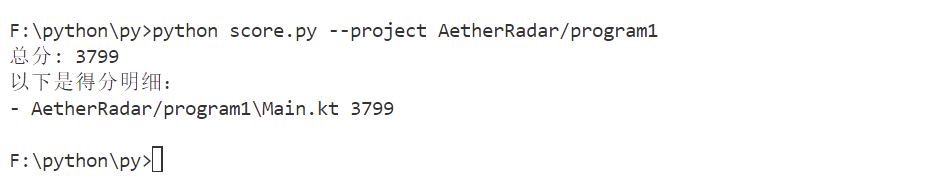

# ASCII码计算器参赛作品

## 实现说明
使用Kotlin实现了一个简单高效的ASCII码计算器。

## 程序说明
- 语言：Kotlin
- 文件：Main.kt
- 功能：计算输入字符串的ASCII码总和

## 使用方法
```bash
kotlin Main.kt
```
然后输入要计算的字符串，程序会输出其ASCII码总和。

## 示例
输入：ABC
输出：198 (65+66+67) 
